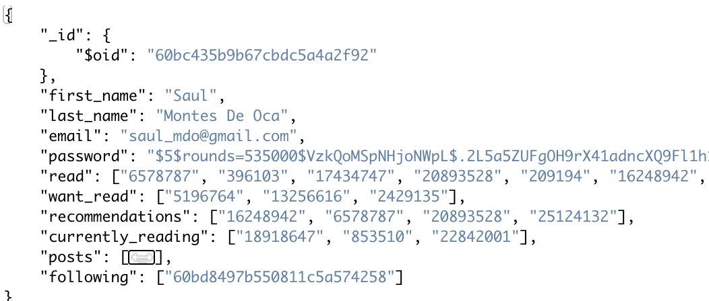
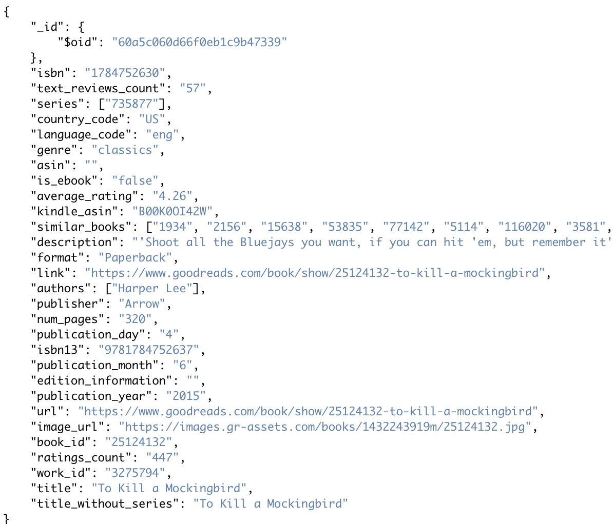
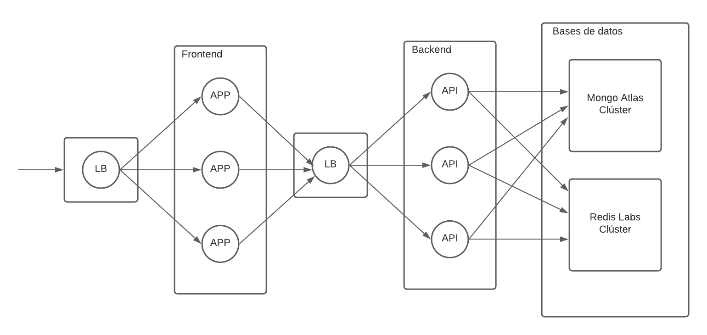

# TC3041 Proyecto Final

# *BookWorms*
---
<div align="center">
    
</div>

##### Integrantes:
1. *[Saúl Montes De Oca](http://github.com/saulmontesdeoca/)* - *A01025975* - *CSF*
2. *[Juan Carlos Hurtado Andrade](https://github.com/CarlosHurand)* - *A01025193* - *CSF*

---
## 1. Aspectos generales

Las orientaciones del proyecto se encuentran disponibles en la plataforma **Canvas**.

Este documento es una guía sobre qué información debe entregar como parte del proyecto, qué requerimientos técnicos debe cumplir y la estructura que debe seguir para organizar su entrega.

### 1.1 Requerimientos técnicos

A continuación se mencionan los requerimientos técnicos mínimos del proyecto, favor de tenerlos presente para que cumpla con todos.

* El equipo tiene la libertad de elegir las tecnologías de desarrollo a utilizar en el proyecto.
* El proyecto debe utilizar al menos dos modelos de bases de datos diferentes, de los estudiados en el curso.
* La arquitectura debe ser modular, escalable, con redundancia y alta disponibilidad.
* La arquitectura deberá estar separada claramente por capas (*frontend*, *backend*, *API RESTful*, datos y almacenamiento).
* Los diferentes componentes del proyecto (*frontend*, *backend*, *API RESTful*, bases de datos, entre otros) deberán ejecutarse sobre contenedores [Docker](https://www.docker.com/) o desplegarse en un servicio en la nube.
* Todo el código, *datasets* y la documentación del proyecto debe alojarse en este repositorio de GitHub siguiendo la estructura que aparece a continuación.

### 1.2 Estructura del repositorio
El proyecto debe seguir la siguiente estructura de carpetas:
```
- / 			        # Raíz de todo el proyecto
    - README.md			# Archivo con los datos del proyecto (este archivo)
    - frontend			# Carpeta con la solución del frontend (Web app)
    - api			# Carpeta con la solución de la API o el backend
    - dbs			# Carpeta con los modelos, catálogos y scripts necesarios para generar las bases de datos
    - docs			# Carpeta con la documentación del proyecto
```

### 1.3 Documentación  del proyecto

Como parte de la entrega final del proyecto, se debe incluir la siguiente información:

* Justificación de los modelo de *bases de datos* que seleccionaron.
* Descripción del o los *datasets* y las fuentes de información utilizadas.
* Guía de configuración, instalación y despliegue de la solución.
* Documentación de la API (si aplica). Puede ver un ejemplo en [Swagger](https://swagger.io/). 
* El código debe estar documentado siguiendo los estándares definidos para el lenguaje de programación seleccionado.

## 2. Descripción del proyecto

Bookworms es una red social de libros en el que los usuarios pueden compartir sus repisas de libros. Los usuarios llamados bookworms, pueden registrarse o hacer login para usar la plataforma. Pueden editar sus repisas, pueden buscar libros por autor o titulo o entrar a la sección de descubrir dónde se encuentran todos los libros desponibles en la red social categorizados por género. Pueden añadirlos a la repisa de su elección. Estas repisas de libros la pueden ver sus seguidores. Como bookworm, tienes acceso a buscar a amigos en la red para seguirlos y tambien ver sus repisas. Las repisas de libros llamadas bookshelves se categorizan como:

 - Recomendaciones
 - Actualmente leyendo
 - Quiero leer
 - Leídos

Al entrar a ver más información sobre algún libro pueden ver su titulo, autor, calificación por BookWorms, descripción, más libros sobre el autor (si estan disponibles en la base de datos), más libros del mismo género, Aquí tambien es donde se despliegan 4 botones los cuales se encargan de añadir o remover de las repisas de los usuarios dicho libro.

## 3. Solución

A continuación aparecen descritos los diferentes elementos que forman parte de la solución del proyecto.

### 3.1 Modelos de *bases de datos* utilizados

Para la base de datos se tienen completados 3 elementos: usuarios, libros, autores y posts. Para una mejor prueba de concepto del proyecto decidimos usar un esquema de bases de datos para mongoDB de Embedding. Como esta planteada la base de datos es que los autores estan embebidos en los documentos de los libros y los posts estan embebidos en los documentos de los usuarios. Se muestran los siguientes ejemplos de los esquemas realizados en mongo.
- Usuarios:

<div align="center">
    
</div>

- Libros:

<div align="center">
    
</div>

Para el manejo de sesiones se utilizó Redis. Cada vez que el frontend hace una petición a la API, se checa primero con Redis si la sesión sigue existiendo. El tiempo de expiración predeterminado por el backend es de 30 minutos. Para Redis se utilizó el siguiente esquema para guardar información del usuario:

```
    'token'
    'email'
    'first_name'
    'last_ame'
```

### 3.2 Arquitectura de la solución

La arquitectura que se trató de implementar fue modular y escalable. Se hizo por capas: api, frontend, dbs, donde las capas de api y frontend estan empaquetadas en contenedores de Docker y son manejadas por contenedores de loadbalancers todo esto orquestado usando minikube. Como funciona el flujo es que se accede primero a un loadbalancer que funciona como frontend del Frontend de bookworms. Despues las peticiones que haga el frontend al API llegan antes a otro loadbalancer que este funciona como frontend del backend. El backend se comunica directamente con los clústers de MongoDB Atlas y RedisLabs. De esta manera se puede alcanzar una solución modular, escalable, con redundancia y alta disponibilidad.

<div align="center">
    
</div>


### 3.3 Frontend

Para el frontend se utilizó React. Principalmente a nivel de las páginas es donde se hacen todos los fetches a la API. Se implemento un módulo de autenticación para el manejo de login y logout. El folder esta dividio como:
```
- bookworms/
    - public/
    - src/
        - auth/
            - Auht
        - components/
            - BookCarousel
            - BookCover
            - BookInfoHeader
            - BookshelfCard
            - BookshelfResume
            - DicoverCarousel
            - FeedCarousel
            - FeedCarouselBook
            - FollowingCard
            - Layout
            - LoginForm
            - LoginLayout
            - Nav
            - PageCover
            - PostCard
            - ProfileCover
            - SearchCard
            - SearchCover
            SearchResult
            - SigninForm
            - UserCard
        - pages/
            - BookDetails
            - Discover
            - Home
            - Login
            - MyBooks
            - Profile
            - Search
            - Signin
        -routing/
            - PublicRoute
            - PrivateRoute
        - App.js
        - index.css
        - index.js
```

#### 3.3.1 Lenguajes de programación

- Javascript
- CSS
- HTML

#### 3.3.2 Framework

- React

#### 3.3.3 Librerías de funciones o dependencias

- react-bootstrap
- react-multi-carousel

### 3.4 API o backend

El backend esta desarrollado con flask. La applicación se conecta a los clústers de bases de datos de MongoDB Atlas y RedisLabs. Cada endpoint antes de hacer alguna operación siempre checa que exista la sesión del usuario en RedisLabs. La API recibe un token del frontend el cual se obtiene mediante cookies. Este token es el id del usuario en MongoDB. Por lo tanto cada operación sabe de que usuario provino. Cada vez que si encuentra la sesión del usuario, el backend renueva el tiempo de expiración de la sesión del usuario en Redis. Cuando no la encuentra manda un response al frontend de que no hay sesión activa para dicho usuario y el frontend deslogea al usuario.

#### 3.4.1 Lenguaje de programación

- Python

#### 3.4.2 Framework

- Flask

#### 3.4.3 Librerías de funciones o dependencias

- redis (python driver)
- pymongo
- passlib
- flask_pymongo
- dnspython

#### 3.4.4 Documentación API

#### @app.route('/redis/<id>', methods=['POST'])
* **Descripción**:
Verificacion de sesión en redis del id. El id se pasa como parametro en la url. Usado para development
* **URL**:
```python
'/redis/<id>'
```
* **Verbos HTTP**:
    - POST
* **Headers**:

| Plugin | README |
| ------ | ------ |
| Content-Type | application/json |
| token | <token> |
* **Formato JSON de la respuesta**:
```json
'No session'
```
* **Códigos de error**:
    - 408: No session

#### @app.route('/session/<token>', methods=['GET'])
* **Descripción**:

Verificacion de sesión en redis del id recibido por cookies. El id se pasa como parametro en la url. Usado para development.

* **URL**:
```python
'/session/<token>'
```
* **Verbos HTTP**:
    - GET
* **Headers**:

| Plugin | README |
| ------ | ------ |
| Content-Type | application/json |
| token | <token> |

* **Formato JSON de la respuesta**:
```json
'No session'
```
* **Códigos de error**:
    - 408: No session

#### @app.route('/login', methods=['POST'])
* **Descripción**:
Login del usuario. Se encarga de ir a buscar a la BD el usuario y si aparece verifica las contraseñas hasheadas.
* **URL**:
```python
'/login'
```
* **Verbos HTTP**:
    - POST
* **Headers**:

| Plugin | README |
| ------ | ------ |
| Content-Type | application/json |
| token | <token> |
* **Formato JSON del cuerpo de la solicitud**: 
```json
{
    "email",
    "password"
}
```
* **Formato JSON de la respuesta**:
```json
{
    "_id":,
    "first_name",
    "last_name",
    "email",
    "read",
    "want_read",
    "recommendations",
    "currently_reading",
    "posts",
    "following"
}
```
* **Códigos de error**:
    - 500: Server error
    - 408: No session

#### @app.route('/signin', methods=['POST'])

* **Descripción**:
Registro del usuario a la base de datos.
* **URL**:
```python
'/signin'
```
* **Verbos HTTP**:
    - POST
* **Headers**:

| Plugin | README |
| ------ | ------ |
| Content-Type | application/json |
| token | <token> |
* **Formato JSON del cuerpo de la solicitud**: 
```json
{
    "first_name",
    "last_name"
    "email",
    "password",
    "password2"
}
```
* **Formato JSON de la respuesta**:
```json
{
    "_id":,
    "first_name",
    "last_name",
    "email",
    "read",
    "want_read",
    "recommendations",
    "currently_reading",
    "posts",
    "following"
}
```
* **Códigos de error**:
    - 500: Server error
    - 408: No session

@app.route('/logout', methods=['POST'])

* **Descripción**:
Va a redis y elimina la sesion obtenida por el token enviado en cookies y recibido por la API
* **URL**:
```python
'/logout'
```
* **Verbos HTTP**:
    - POST
* **Headers**:

| Plugin | README |
| ------ | ------ |
| Content-Type | application/json |
| token | <token> |

* **Códigos de error**:
    - 500: Server error
    - 408: No session

#### @app.route('/users', methods=['GET'])

* **Descripción**:
Devuelve todos los usuarios en la base de datos
* **URL**:
```python
'/users'
```
* **Verbos HTTP**:
    - GET
* **Headers**:

| Plugin | README |
| ------ | ------ |
| Content-Type | application/json |
| token | <token> |

* **Formato JSON de la respuesta**:
Un array de objetos como el siguiente:
```json
{
    "_id":,
    "first_name",
    "last_name",
    "email",
    "read",
    "want_read",
    "recommendations",
    "currently_reading",
    "posts",
    "following"
}
```
* **Códigos de error**:
    - 404: Not found
    - 408: No session

#### @app.route('/users', methods=['POST'])

* **Descripción**:
Registra a un usuario a la base de datos
* **URL**:
```python
'/users'
```
* **Verbos HTTP**:
    - POST
* **Headers**:

| Plugin | README |
| ------ | ------ |
| Content-Type | application/json |
| token | <token> |
* **Formato JSON del cuerpo de la solicitud**: 
```json
{
    "first_name",
    "last_name"
    "email",
    "password",
    "password2"
}
```
* **Códigos de error**:
    - 500: Server error
    - 408: No session

#### @app.route('/user/<id>', methods=['GET'])

* **Descripción**:
Regresa el usuario que su id hace match con el recibido en la url
* **URL**:
```python
'/user/<id>'
```
* **Verbos HTTP**:
    - GET
* **Headers**:

| Plugin | README |
| ------ | ------ |
| Content-Type | application/json |
| token | <token> |

* **Formato JSON de la respuesta**:
```json
{
    "_id":,
    "first_name",
    "last_name",
    "email",
    "read",
    "want_read",
    "recommendations",
    "currently_reading",
    "posts",
    "following"
}
```
* **Códigos de error**:
    - 404: Not found
    - 408: No session

#### @app.route('/user/<id>', methods=['DELETE'])

* **Descripción**:
Elimina usuario que su id hace match con el recibido en la url
* **URL**:
```python
'/user/<id>'
```
* **Verbos HTTP**:
    - DELETE
* **Headers**:

| Plugin | README |
| ------ | ------ |
| Content-Type | application/json |
| token | <token> |

* **Códigos de error**:
    - 404: Not found
    - 408: No session

#### @app.route('/get_users', methods=['POST'])

* **Descripción**:
Regresa todos los usuarios cuyo nombre hace match con el query obtenido
* **URL**:
```python
'/get_users'
```
* **Verbos HTTP**:
    - POST
* **Headers**:

| Plugin | README |
| ------ | ------ |
| Content-Type | application/json |
| token | <token> |
* **Formato JSON del cuerpo de la solicitud**: 
```json
{
    "query"
}
```
* **Formato JSON de la respuesta**:
Un array de objetos con el siguiente formato
```json
{
    "_id":,
    "first_name",
    "last_name",
    "email",
    "read",
    "want_read",
    "recommendations",
    "currently_reading",
    "posts",
    "following"
}
```
* **Códigos de error**:
    - 404: Not found
    - 500: Server error
    - 408: No session

#### @app.route('/get_books', methods=['POST'])

* **Descripción**:
Regresa todos los libros cuyo titulo hace match con el query obtenido
* **URL**:
```python
'/get_books'
```
* **Verbos HTTP**:
    - POST
* **Headers**:

| Plugin | README |
| ------ | ------ |
| Content-Type | application/json |
| token | <token> |
* **Formato JSON del cuerpo de la solicitud**: 
```json
{
    "query"
}
```
* **Formato JSON de la respuesta**:
```json
{
    "_id",
    "isbn",
    "text_reviews_count"",
    "series",
    "country_code",
    "language_code",
    "genre",
    "asin",
    "is_ebook",
    "average_rating",
    "kindle_asin",
    "similar_books",
    "description",
    "format",
    "link",
    "authors",
    "publisher",
    "num_pages",
    "publication_day",
    "isbn13",
    "publication_month",
    "edition_information",
    "publication_year",
    "url",
    "image_url",
    "book_id",
    "ratings_count",
    "work_id",
    "title",
    "title_without_series"
}
```
* **Códigos de error**:
    - 404: Not found
    - 408: No session

#### @app.route('/get_books', methods=['GET'])

* **Descripción**:
Devuelve todos los libros en la base de datos
* **URL**:
```python
'/get_books/<id>'
```
* **Verbos HTTP**:
    - GET
* **Headers**:

| Plugin | README |
| ------ | ------ |
| Content-Type | application/json |
| token | <token> |
* **Formato JSON de la respuesta**:
Un array de objetos con el siguiente formato:

```json
{
    "_id",
    "isbn",
    "text_reviews_count"",
    "series",
    "country_code",
    "language_code",
    "genre",
    "asin",
    "is_ebook",
    "average_rating",
    "kindle_asin",
    "similar_books",
    "description",
    "format",
    "link",
    "authors",
    "publisher",
    "num_pages",
    "publication_day",
    "isbn13",
    "publication_month",
    "edition_information",
    "publication_year",
    "url",
    "image_url",
    "book_id",
    "ratings_count",
    "work_id",
    "title",
    "title_without_series"
}
```
* **Códigos de error**:
    - 500: Server error
    - 408: No session

#### @app.route('/find_book/<id>', methods=['GET'])

* **Descripción**:
Devuelve el libro que matchea con el id obtenido en la url del GET request
* **URL**:
```python
'/find_book/<id>'
```
* **Verbos HTTP**:
    - GET
* **Headers**:

| Plugin | README |
| ------ | ------ |
| Content-Type | application/json |
| token | <token> |

* **Formato JSON de la respuesta**:
```json
{
    "_id",
    "isbn",
    "text_reviews_count"",
    "series",
    "country_code",
    "language_code",
    "genre",
    "asin",
    "is_ebook",
    "average_rating",
    "kindle_asin",
    "similar_books",
    "description",
    "format",
    "link",
    "authors",
    "publisher",
    "num_pages",
    "publication_day",
    "isbn13",
    "publication_month",
    "edition_information",
    "publication_year",
    "url",
    "image_url",
    "book_id",
    "ratings_count",
    "work_id",
    "title",
    "title_without_series"
}
```
* **Códigos de error**:
    - 404: Not found
    - 408: No session

#### @app.route('/getBooks/<genre>', methods=['GET'])
    
* **Descripción**:
Regresa todos los libros que matchean el genero dado en la url del GET request
* **URL**:
```python
'/get_books/<genre>'
```
* **Verbos HTTP**:
    - GET
* **Headers**:

| Plugin | README |
| ------ | ------ |
| Content-Type | application/json |
| token | <token> |
* **Formato JSON de la respuesta**:
Un array de objetos con el siguiente formato:
```json
{
    "_id",
    "isbn",
    "text_reviews_count"",
    "series",
    "country_code",
    "language_code",
    "genre",
    "asin",
    "is_ebook",
    "average_rating",
    "kindle_asin",
    "similar_books",
    "description",
    "format",
    "link",
    "authors",
    "publisher",
    "num_pages",
    "publication_day",
    "isbn13",
    "publication_month",
    "edition_information",
    "publication_year",
    "url",
    "image_url",
    "book_id",
    "ratings_count",
    "work_id",
    "title",
    "title_without_series"
}
```
* **Códigos de error**:
    - 404: Not found
    - 408: No session

#### @app.route('/get_authors', methods=['POST'])

* **Descripción**:
Regresa todos los libros cuyo autor matchea el query dado
* **URL**:
```python
'/get_auhtors'
```
* **Verbos HTTP**:
    - POST
* **Headers**:

| Plugin | README |
| ------ | ------ |
| Content-Type | application/json |
| token | <token> |
* **Formato JSON del cuerpo de la solicitud**: 
```json
{
    "query"
}
```
* **Formato JSON de la respuesta**:
Un array de objetos con el siguiente formato
```json
{
    "_id",
    "isbn",
    "text_reviews_count"",
    "series",
    "country_code",
    "language_code",
    "genre",
    "asin",
    "is_ebook",
    "average_rating",
    "kindle_asin",
    "similar_books",
    "description",
    "format",
    "link",
    "authors",
    "publisher",
    "num_pages",
    "publication_day",
    "isbn13",
    "publication_month",
    "edition_information",
    "publication_year",
    "url",
    "image_url",
    "book_id",
    "ratings_count",
    "work_id",
    "title",
    "title_without_series"
}
```
* **Códigos de error**:
    - 404: Not found
    - 408: No session

#### @app.route('/mybookshelves/<bookshelf>', methods=['GET'])

* **Descripción**:
Regresa todos los libros de un bookshelf del user que tiene el id igual que el token recibido
* **URL**:
```python
'/mybookshelves/<bookshelf>'
```
* **Verbos HTTP**:
    - GET
* **Headers**:

| Plugin | README |
| ------ | ------ |
| Content-Type | application/json |
| token | <token> |

* **Formato JSON de la respuesta**:
Un array de objetos con el siguiente formato:
```json
{
    "_id",
    "isbn",
    "text_reviews_count"",
    "series",
    "country_code",
    "language_code",
    "genre",
    "asin",
    "is_ebook",
    "average_rating",
    "kindle_asin",
    "similar_books",
    "description",
    "format",
    "link",
    "authors",
    "publisher",
    "num_pages",
    "publication_day",
    "isbn13",
    "publication_month",
    "edition_information",
    "publication_year",
    "url",
    "image_url",
    "book_id",
    "ratings_count",
    "work_id",
    "title",
    "title_without_series"
}
```
* **Códigos de error**:
    - 404: Not found
    - 408: No session

#### @app.route('/mybookshelf/<action>', methods=['POST'])

* **Descripción**:
Agrega o elimina un libro del bookshelf de un usuario
* **URL**:
```python
'/mybookshelf/<action>'
```
* **Verbos HTTP**:
    - POST
* **Headers**:

| Plugin | README |
| ------ | ------ |
| Content-Type | application/json |
| token | <token> |
* **Formato JSON del cuerpo de la solicitud**: 
```json
{
    "bookshelf",
    "book_id"
}
```
* **Códigos de error**:
    - 500: Server error
    - 408: No session

#### @app.route('/posts', methods=['GET'])

* **Descripción**:
Obtiene todos los post de todos los usuarios que esta siguiendo el usuario que tiene el mismo id que el token recibido
* **URL**:
```python
'/posts'
```
* **Verbos HTTP**:
    - GET
* **Headers**:

| Plugin | README |
| ------ | ------ |
| Content-Type | application/json |
| token | <token> |
* **Formato JSON de la respuesta**:
```json
{
    "user_id",
    "first_name",
    "last_name",
    "bookshelf",
    "date",
    "book_id",
    "book_img",
    "book_title",
    "authors",
    "rating"
}
```
* **Códigos de error**:
    - 404: Not found
    - 408: No session

#### @app.route('/follow', methods=['POST'])

* **Descripción**:
Agrega el id recibido al array de following de un usuario en la base de datos
* **URL**:
```python
'/follow'
```
* **Verbos HTTP**:
    - POST
* **Headers**:

| Plugin | README |
| ------ | ------ |
| Content-Type | application/json |
| token | <token> |
* **Formato JSON del cuerpo de la solicitud**: 
```json
{
    "following"
}
```
* **Códigos de error**:
    - 500: Server error
    - 408: No session

## 3.5 Pasos a seguir para utilizar el proyecto
    
Primero debes de asegurarte de tener instalado [Docker](https://docs.docker.com/engine/install/) y ejecutarlo.
    
Luego tienes que clonar el repositorio y cambiarte a la carpeta descargada:
```ssh
git clone git@github.com:tec-csf/tc3041-pf-primavera-2021-team7.git
cd tc3041-pf-primavera-2021-team7
```

Se puede utilizar el proyecto de dos formas:
1. Docker-compose
    
Solamente tienes que ejecutar los siguientes comandos
```ssh
docker-compose up -d
```
    
2. Minikube

 Para realizarlo con kubernetes en minikube debes de tener instalado [Minikube](https://minikube.sigs.k8s.io/docs/start/) y [Kubectl](https://kubernetes.io/es/docs/tasks/tools/install-kubectl/).

```ssh
minikube start
eval $(minikube docker-env)
kubectl apply -f api-claim0-persistentvolumeclaim.yaml,api-deployment.yaml,client-claim0-persistentvolumeclaim.yaml,client-deployment.yaml,lb-backend-claim0-persistentvolumeclaim.yaml,lb-backend-deployment.yaml,lb-backend-service.yaml,lb-frontend-claim0-persistentvolumeclaim.yaml,lb-frontend-deployment.yaml,lb-frontend-service.yaml,node-modules-persistentvolumeclaim.yaml

kubectl service lb-frontend
```

## 4. Referencias

*[Incluya aquí las referencias a sitios de interés, datasets y cualquier otra información que haya utilizado para realizar el proyecto y que le puedan ser de utilidad a otras personas que quieran usarlo como referencia]*
